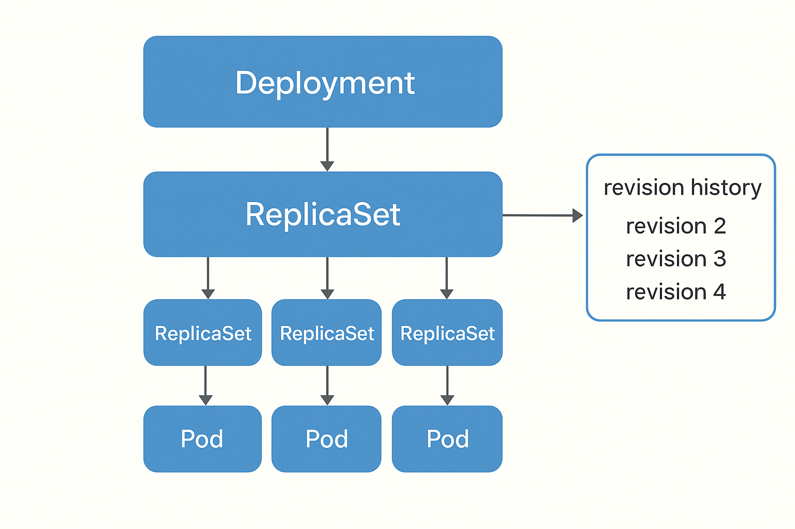

# 🧪 Module 3 Lab: Orchestration with Kubernetes

**Goal:** Practice building, persisting, and connecting Kubernetes objects 
**Note:** You can view the result of executing the following commands and exercises using [Lens](https://k8slens.dev/) or another editor. However, we recommend using the command line at the beginning.

---

### 🧩 kubectl: Using a powerful tool

**Questions:**
- What are the next commands used for?
	- `kubectl config view`
	- `kubectl api-versions` 
	- `kubectl api-resources`
	- `kubectl get all`
	- `kubectl apply -f pod.yaml`
	- `kubectl run - -rm -ti [namePod] --image=[dockerImage] -- sh`. Creates a temporary pod using the image and opens its shell.
	- `kubectl get pod [pod]` and `kubectl get pods`

---

### 🧩 Pods: Creating pods

**Steps:**
1. Use pod.yaml file provided in the project
2. Execute `kubectl apply -f pod.yaml`
3. Verify that a new pod exists
4. Delete the pod
5. Modify pod.yaml to add another pod and reapply the manifest
6. Create a new manifest called **labels.yml**. Add the labels 'app' and 'env' in the metadata section

**Keep an eye to this:**
- A container cannot update itself. It requires a higher-level object

**Questions:**
- What are the next commands used for?
	- `kubectl apply -f <filename>`
	- `kubectl get pods -l app=<label>`
	- `kubectl get pod [podName] -o yaml`	
	- `kubectl delete pod [podName]`	
	- `kubectl delete -f [fileName]`	
	- `kubectl describe <name>`
	- `kubectl logs <name> -c <container>`
	- `kubectl exec -it <name> -c <container> -- sh`
- When you create a pod with 2 constainers inside, **can you access one container from the other? Do they share the same network?**


### 🧩 Pods: Several containers in one pod

1. Execute `kubectl apply -f containers.yaml`. 
2. This manifest defines a Pod with two containers. Each container runs a Python server. You can verify that each one is running correctly with: `kubectl logs doscont -c [cont1 | cont2]`
3. Enter one of the containers using `kubectl exec -ti doscont -c cont1 -- sh`
4. Run `curl localhost:8082` and `curl localhost:8083`. What happens? Why can you reach both addresses? (Hint: They share the same network namespace, so each container can reach itself and the other one)
5. Update the Deployment so both containers use the same port. What happens?

---

### 🧩 ReplicaSets: Using ReplicaSets

**Steps:**
1. Deploy the replicaset.yaml file provided in the project
2. Delete one pod
3. Verify that Kubernetes creates a new pod automatically
4. Modify replicaset.yaml to increase the number of replicas. **What happens?**

---

### 🧩 Deployments

**Steps:**
1. Deploy the dep.yaml file provided in the project and verify it was created successfully.
2. Modify the image used by replacing nginx:alpine with nginx. Also, remove the 'ports' element
3. Verify the changes in real time using `kubectl rollout status deployment [deploymentName]`
4. Make another change: revert to the first image (nginx:alpine) and set the port to 90. 
5. Add the following annotation to metadata section (excerpt):
```yaml
metadata:
  annotations:
    kubernetes.io/change-cause: "Change port to 110"
  name: deployment-test
  labels:
    app: front
```
- Verify it using `kubectl rollout history deployment [deploymentName]`. **Can you see the annotation?**

6. Set the parameter **revisionHistoryLimit** to 1 to limit the revision history (see the excerpt below). Then reapply the deployment using `kubectl apply -f <fileName>`
```yaml
spec:
  revisionHistoryLimit: 1
  replicas: 3
  selector:
    matchLabels:
      app: front
```
- The **revisionHistoryLimit** field in a Deployment controls how many old ReplicaSets Kubernetes keeps for rollback purposes. For example, if you set it to 3, Kubernetes will keep only the last 3 revisions of the Deployment’s ReplicaSets. **Older ReplicaSets will be garbage collected automatically.**
	- **You cannot see old revisions beyond what kubectl rollout history shows**. If you want to keep full history, you need to increase **revisionHistoryLimit.**



7. **Introduce a fake into the manifest**: change the image name to name nginx:testfake to force an error.
	- Execute `kubectl get pods`. **Can you see the error?**
	- Execute `kubectl rollout history deployment [deploymentName]`. **Is it possible to perform the rollback?**

8. **Rollback mechanism**
	- Check the status of the deployment: `kubectl rollout status deployment/<deployment-name>`. This will tell you if the deployment is stuck or failed
	- Rollback to the previous revision: `kubectl rollout undo deployment/<deployment-name>`. This will revert the deployment to the last successful revision (by default, it rolls back one revision).
	- (Optional) Rollback to a specific revision: `kubectl rollout undo deployment/<deployment-name> --to-revision=<revision-number>`
	- Pause/resume deployments: 	
	```
	kubectl rollout pause deployment/<deployment-name>
	kubectl rollout resume deployment/<deployment-name>
	```


**Questions:**
- What are the next commands used for?
	- `kubectl get deployment --show-labels`
	- `kubectl rollout status deployment [deployName]` and `kubectl rollout history deployment [deployName]`

---

### 🧩 Services: the higher level

**Steps:**

1. Deploy svc.yaml
2. Observe the following:
	- Port mapping and entry sequence:
		- Service IP: Kubernetes guarantees the service IP (it does not change)
		- Service port → spec > ports > port > maps to a port on your machine
		- Pod ports where the Service redirects traffic → spec > ports > targetPort
		- **ClusterIP** is the default service. It is a **load balancer between pods**, which will be managed by a Deployment.
3. Introduce another type of Service (default type, ClusterIP) and redeploy it (use svc2.yaml). Use `kubectl delete -f svc.yaml` and `kubectl apply -f svc2.yaml`

```yaml
apiVersion: v1 
kind: Service
metadata:
  name: my-service
  labels:
    app: front
spec:
  type: ClusterIP
  selector: 
    app: front
  ports:
    - protocol: TCP
      port: 8080 
      targetPort: 80 
```

4. **Port Forwarding**: Accessing from outside of k8s cluster (only for develop purposes)
	- From localhost, execute `kubectl port-forward service/[myService] -n [namespace] [external_port]:[pod_port]`
		- In the example, `kubectl port-forward service/my-service -n default 8081:8080`.
			- Keep in mind: forward redirects **service > spec > ports > port** to a port on host
	- To access from any IP, execute `kubectl port-forward service/[myService] -n [namespace] [external_port]:[pod_port] --address 0.0.0.0`	
	- Try to do it using Lens and redirects to the port 8080 as well
	- Check the redirections to localhost:8080 and 8081 running correctly. Everything is ok? What is happening?


5. **minikube tunnel**. 
	- To make available any service, we can make a tunnel executing `minikube service ingress-nginx-controller -n ingress-nginx  --url [url]`	


6. **NodePort**.

	- Deploy nodeport.yml (svc.yaml is already deployed). It uses nodeport instead ClusterIP.
	- Execute `kubectl get pods -l app=[front | backend`. **How many pods can you see?**
	- Now execute `kubectl get svc`. **How many services are deployed?**
	- **What port is exposing Nodeport?**
	- Forward the port using `kubectl port-forward service/my-service1 -n default 8081:8080`. Can you access index.html from nginx?


---

### 🧩 Namespaces and Contexts: tidying the room

**Steps:**

1. Create two namespaces by applying the manifest ns.yml. 
2. Verify the deployment using `kubectl get deploy -n dev` and `kubectl get pods -n dev`
	- **How many replicas are there in each one?**
4. **Using DNSs**. Apply ns-and-dns.yml
	- Create an ephemeral pod using `kubectl run --rm -ti podtest3 --image=nginx:alpine -- sh`
	- Try to reach another service using curl (`curl backend-k8s-hands-on`). **What happens?**
	- Try it again using the full domain name [ServiceName].[NamespaceName].svc.cluster.local. **Does it still not work?**
5. **Contexts**.
	- Review the configuration options using `kubectl config view`
	- Create a new context linked to a specific namespace. You can do this with `kubectl config set-context ci-context --namespace ci --cluster minikube --user=minikube`
	- Switch to the new context using (`kubectl config use-context ci-context`)
	- **Can you see the default resources? Is it necessary to select the context? Explain why.**
	- Delete the context using `kubectl config delete-context <oldContext>`. Default context is active again.


---

### 🧩 Probes: is there anybody?

**Steps:**

1. **Liveness**:
	- Apply liveness-cmd.yml.
	- Liveness sequence:
		- Every 5 seconds it performs a cat on the file. When it reaches the 35-second mark, it will fail.
		- Kubernetes will restart the container inside the pod. After another 35 seconds, it will fail again.
		- This sequence will repeat several times until it enters **CrashLoopBackOff**, which means Kubernetes tried multiple times but a bug causes the container to crash, and it will stop restarting it.
	- **Commands sequence used:**
		- `kubectl get pods`
		- `kubectl get pods -w` to watch events that occur on the pods
		- `kubectl describe pod liveness-exec` 	to analyze the full event log

2. **Readiness**
	- Apply liveness-tcp.yml
	- Analyze the manifest and keep an eye to this: **Readiness** deregisters the container's ports from the service if there is an error, but it does not restart the container.

---

### 🧩 ConfigMaps: Config management using cmd

**Steps:**

1. Create the Nginx config file in `configmaps-examples`.
2. Create the ConfigMap with the command `kubectl create configmap nginx-config --from-file=configmaps-examples/nginx.conf`
3. `kubectl describe cm nginx-config` shows the key (the file name by default) and all associated fields.
4. We can create a ConfigMap with multiple files by providing the folder path: `kubectl create configmap nginx-config1 --from-file=configmaps-examples`
5. We verify the content with two keys (`index.html` and `nginx.conf`) using: `kubectl describe cm nginx-config1`

---

### 🧩 ConfigMaps: Config management using manifests

**_Volumes_**

**Steps:**
1. Analyze the example with volumes in cm-nginx-vol.yaml
2. Creates a deployment to consume it


**_Environment vars_**

**Steps:**

1. We will create another ConfigMap with a script and environment variables: the env vars will be consumed from the described ConfigMap. See `cm-nginx-env.yml`
	- We create a script that echoes to the Nginx root folder, outputting to a file. This will be the script.
2. We specify the script in a volume and mount the environment variables by referencing the indicated ConfigMap.
3. We create a Pod, enter it, and validate the environment variables using env.
4. We check the script created in /opt and execute it.
	- `cat /usr/share/nginx/html/test.html` correctly captures the environment variables.


---

### 🧩 Secrets: Config management using manifests

**_Secret from a txt file_**

**Steps:**

1. Use following commands:
	- `kubectl create secret generic mysecret --from-file=./secret-files/test.txt`
  - `kubectl get secrets -o yaml`
  - `kubectl describe secrets mysecret`
2. Secrets are codified in base64

**_Secret from a manifest_**

**Steps:**

1. Use secret-data.yml and the commands above to analyze how K8s stores sensitive data.
2. Use secret-stringdata.yml. StringData directly encodes the sensitive data.


**_Hiding Credentials / Value Substitution_**

**Steps:**

1. Creation of a file with hidden secrets (secret-secure.yml). 
	- Kubernetes does not correctly substitute placeholders when we provide values for environment variables.
2. Hiding and setting values:
	- We create a file referencing environment variables (`secret-secure_2.yml`).
	- We use the tool envsubst to replace the file’s placeholders with the previously created environment variable values.
	- We output to a new file not saved in version control (`envsubst < secret-secure_2.yml > tmp.yml`).
	- We apply the new file (`kubectl apply -f tmp.yml`).


**_Setting Credentials with Volumes_**

**Steps:**

1. Create a manifest with secrets and a Pod in `pod-vol-secret.yml`. Execute kubectl apply -f `pod-vol-secret.yml`
2. The user/password are set in the secret using `stringData` (converted to base64).
3. We create volumes that pass the credentials to files (user/password). Review the manifest to analyze
4. Credentials can be loaded by reading the file
5. Check the results entering in the container and using the command `kubectl get secret secret1 -o yaml`


**_Using Credentials with Volumes + Environment Variables_**

1. Create a manifest with secrets and a Pod in `pod-vol-and-envs.yml`.
2. We create environment variables that point to the secret created above.
	- `export VAR_NAME="value"`
	- `echo $VAR_NAME`
3. It is easier to load credentials as environment variables than by reading from a file (as in the previous example).

---

### 🧩 Volumes: static provisioning

**Steps:**

1. **Empty dir**
	- Apply empty-dir.yml. 
	- This pod contains a mountPath element and a volume emptyDir inside the Nginx logs directory (`/var/log/nginx`).The directory will be available as long as the pod is alive.
	- If the container is recreated, the directory will still be available (Kubernetes detects if the container died and recreates it).
	- Enter into the pod (`kubectl exec -it test-pd -- sh`) and create an empty file inside the `emptyDir` (`touch /var/log/nginx/test.log`).
	- Kill the Nginx process (`pkill nginx`). The container dies. **What occurs now?** (Kubernetes recreates the container)
	- Enter into the pod again and see that the file we created is still there (it’s linked to the pod, which didn’t die).
	- This mechanism is often used for caching.

2. **Persistent Volume / Persistent Volume Claim**
	- Apply pv-pvc.yml (with no selectors)
	- The steps are always the same:
		- **Creation of a PersistentVolume (PV).** The place where data is stored physically.
			- This can point to a physical location, a cloud location, etc. (For practice purposes, we will create a `hostPath` (directory) in the local cluster, and that folder will act as a PV.)
		- **Creation of the Claim (PersistentVolumeClaim, PVC).** The entity that claims or points to the PV.
		- **Creation of the volume inside the container,** which will point to the PVC.
	- Review the right volume creation using:
		- `kubectl get pv --show-labels`
		- `kubectl describe pv task-pv-volume`
		- `kubectl get pvc --show-labels`. Check the status; it is BOUND to the corresponding volume.
	- Apply pv-pvc-selectors.yml (to force a Claim to use a specific PV.
		- When checking the PVs, we see one PV **available** but another **bound** (`kubectl get pv --show-labels`).

3. **Linking a PV/PVC to a pod**
	- Apply pod-pvc.yml.
	- In addition to the PV/PVC, we add a Deployment with a Pod that mounts the volume
	- When checking the created Pod, we can see the Mount (`kubectl describe pod xxxx`)
	- Enter the Pod and access MySQL via cmd
	- Create a database
	- Now exit and delete the Pod. **The ReplicaSet recreates the Pod**
	- When entering MySQL again, the database created in the previous Pod can be seen :)


### 🧩 Volumes: dynamic provisioning

**Steps:**

1. Apply storage-class.yml. **K8s will create the PV if a PVC doesn’t find one available.** This is done using a storageClass
2. We create the PVC and check it (kubectl get pvc). It appears linked to a PV.
	- `kubectl get pv` shows a standard hostPath PV (the one allowed by Minikube) that was created by K8s.
	- This storageClass could be a dynamic storage from AWS, Google Cloud, Azure, etc. (provided by a production K8s installation).
	- **Note**: the default ReclaimPolicy is Delete, which is dangerous (dynamic PVs will be deleted if we delete the PVC). When deleting the PVC (`kubectl delete -f storage-class.yml`), the PV is also deleted.
	- `kubectl describe pv [pvname]` allows us to see the path where Minikube installed it (it will be accessible inside the Minikube container). This resource is dynamic. When creating the Claim, the PV is automatically created.	
