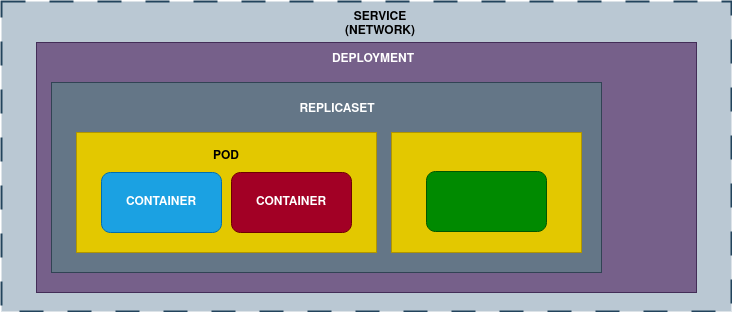

# ✨ Module 3 References: Orchestration with Kubernetes

References:

- [kubectl Quick Reference](https://kubernetes.io/docs/reference/kubectl/quick-reference/)
- [Pods](https://kubernetes.io/docs/concepts/workloads/pods/)
- [Deployments](https://kubernetes.io/docs/concepts/workloads/controllers/deployment/)
- [ReplicaSet](https://kubernetes.io/docs/concepts/workloads/controllers/replicaset/)
- [StatefulSet](https://kubernetes.io/docs/concepts/workloads/controllers/statefulset/)

---

### Tips

_**Pods**_

- A pod cannot update itself. You must either delete and recreate it, or update it through a higher-level object (Deployment or ReplicaSet).
- Do not create pods manually (except for ephemeral or temporary pods). Always create them through higher-level controllers like ReplicaSets or Deployments.
- Never create “flat” PODs **without an owner**. They must be created by higher-level objects (e.g., ReplicaSets).
- If you label a pod without a label, and it matches another label that a ReplicaSet manages, the ReplicaSet will adopt the pod (including it in the requested number of replicas), and this is dangerous.

_**Deployment**_

- Parameters:
	- MaxUnavailable: How many pods you allow to be unavailable. Defines the percentage of pods that can be down while ensuring the rest remain available. Default value = 25%.
	- MaxSearch: How many additional pods can be created above 100% during an update. Defines the scaling capacity while performing an update. Default value = 25%.

_**ReplicaSet**_

- Changes to running ReplicaSets:
	- If you change the YAML file and execute apply, nothing will update automatically. You must delete the pod. Then the ReplicaSet will create pods according to the description in the YAML file.

_**Service**_

- A Service provides a stable IP address that is maintained over time and guaranteed by the cluster. This is not the case with pods, which can die and be replaced by a new pod with a different IP. A Service also has a unique DNS name.
- A Service needs an Endpoint to route traffic to (entrypoint).
	- If no type is specified, it defaults to ClusterIP (a virtual IP not associated with a physical MAC).
- By default, all services have DNS [ServiceName].[NamespaceName].svc.cluster.local

**Service types:**

- **ClusterIP**
	- Default Service type. The IP is only accessible from within the cluster node. Used for internal communication between Services. We **cannot expose** the service externally (you would need to expose a LAN or Wi-Fi IP to access it).
	- It also acts as a **load balancer** between pods, which are managed by a Deployment.
- **NodePort** 
	- Allows us to expose the Service outside the cluster. It exposes the service through a port on the node, which has an IP accessible from outside, allowing access to the ClusterIP.
	- It opens a default port range (**30000–32767**), but not beyond the cluster. If not defined, NodePort will choose one automatically.
	- Minikube does not expose NodePorts on your host IP (127.0.0.1) by default, as cloud Kubernetes clusters do.
	- To access the port, it is necessary to:
		- **Port-forward:** `kubectl port-forward service/[serviceName] -n [namespace] [clusterPort]:[podPort]`
  		- **Minikube tunnel:** `minikube service [serviceName] -n [namespaceName] --url [url]`. In any case, a NodePort **creates a ClusterIP** internally to communicate with. It does not replace it.
- **LoadBalancer**
	- Creates only **external load balancers** (Kubernetes has no built-in option for this by default).
	- It opens NodePorts on each node so users can access the balancer. When you create a LoadBalancer, you automatically create a NodePort, which in turn creates a ClusterIP.

---

### Useful commands 

- `apk add -U <package>`. Install packages needed into an Alpine image

